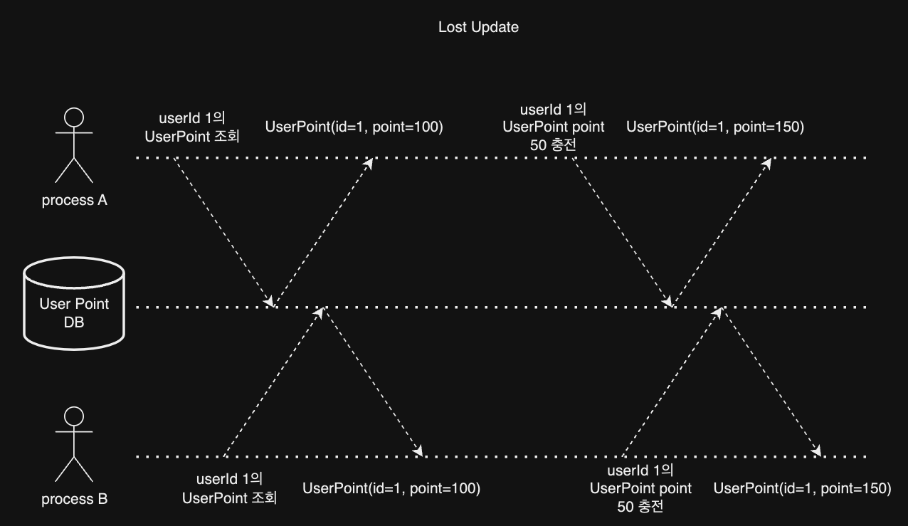

# 동시성 제어 방식에 대한 분석

## 1. 동시성 제어(Concurrency Control)의 개념과 중요성

동시성 제어는 다중 사용자 환경에서 데이터베이스나 공유 자원의 일관성과 무결성을 유지하기 위한 핵심 기술이다.  
여러 사용자가 동시에 같은 데이터에 접근할 때 발생할 수 있는 문제를 예방하고 해결하는 것이 주요 목적이다.

### 동시성 제어의 필요성

- 데이터 일관성 유지
- 시스템의 안정성 확보
- 사용자 간 공정한 자원 접근 보장
- 데이터 손실 및 오류 방지

## 2. 동시성 이슈(Concurrency Issue)의 유형

동시성 이슈는 여러 형태로 나타날 수 있으며, 주요 유형은 다음과 같다.

1. **Lost Update (갱신 손실)**: 두 트랜잭션이 동시에 같은 데이터를 수정할 때, 한 트랜잭션의 수정사항이 다른 트랜잭션에 의해 덮어쓰여지는 문제

2. **Dirty Read (오손 읽기)**: 한 트랜잭션이 아직 커밋되지 않은 다른 트랜잭션의 중간 결과를 읽는 문제

3. **Non-Repeatable Read (반복 불가능한 읽기)**: 한 트랜잭션 내에서 같은 데이터를 두 번 읽었을 때 결과가 다른 문제

4. **Phantom Read (유령 읽기)**: 한 트랜잭션에서 두번의 동일한 조회를 하였을 때, 다른 트랜잭션의 Insert로 인해 없던 데이터가 조회 문제

## 3. 과제에서 발생할 수 있는 동시성 이슈 (lost update)



위의 이미지는 lost update 문제를 설명한 것이다.

- **Charge 메서드의 동시 실행**: 하나의 userId에 대해 여러 스레드가 동시에 Charge 메서드를 실행할 때, Lost Update 문제가 발생할 수 있고 history가 순차적으로 저장되지 않을 수 있다.

- **Use 메서드의 동시 실행**: 하나의 userId에 대해 여러 스레드가 동시에 Use 메서드를 실행할 때, Lost Update 문제가 발생할 수 있고 history가 순차적으로 저장되지 않을 수 있다.

- **Charge와 Use 메서드의 동시 실행**: Charge와 Use 메서드가 동시에 실행될 때, 데이터 일관성 문제가 발생할 수 있고 history가 순차적으로 저장되지 않을 수 있다.

## 3. 자바에서의 동시성 제어 방법

자바는 다양한 동시성 제어 메커니즘을 제공한다.  
`PointServiceImpl` 클래스를 예시로, 다양한 동시성 제어 방법 적용을 통해 동시성 이슈를 해결하는 방법을 살펴보자.

```java
@Service
@RequiredArgsConstructor
public class PointServiceImpl implements PointService {

  private final PointRepository pointRepository;

  private final PointHistoryRepository pointHistoryRepository;

  @Override
  public UserPoint charge(UserPointCommand.Charge command) {
    final var userPoint = pointRepository.findById(command.userId())
        .orElseThrow(() -> new BusinessException(PointErrorCode.USER_POINT_NOT_FOUND));

    final var updatedUserPoint = pointRepository.update(userPoint.addPoint(command.amount()));

    pointHistoryRepository.insert(
        PointHistory.from(userPoint.id(), command.amount(), TransactionType.CHARGE,
            System.currentTimeMillis()));

    return updatedUserPoint;
  }

  @Override
  public UserPoint use(UserPointCommand.Use command) {
    final var userPoint = pointRepository.findById(command.userId())
        .orElseThrow(() -> new BusinessException(PointErrorCode.USER_POINT_NOT_FOUND));

    final var updatedUserPoint = pointRepository.update(userPoint.usePoint(command.amount()));

    pointHistoryRepository.insert(
        PointHistory.from(userPoint.id(), command.amount(), TransactionType.USE,
            System.currentTimeMillis()));

    return updatedUserPoint;
  }

  @Override
  public UserPoint getUserPoint(UserPointCommand.GetUserPoint command) {
    return pointRepository.findById(command.userId()).orElse(null);
  }

  @Override
  public List<PointHistory> getUserPointHistories(GetUserPointHistories command) {
    return pointHistoryRepository.findAllByUserId(command.userId());
  }
}
```

### 3.1 synchronized 키워드

`synchronized` 키워드는 자바의 가장 기본적인 동기화 방법이다.

#### 특징

- 간단하고 직관적인 사용법
- 메서드 전체 또는 특정 블록에 적용 가능
- 자동으로 lock 획득 및 해제

#### 상세 예시

```java
@Service
@RequiredArgsConstructor
public class SynchronizedPointServiceImpl implements PointService {

    private final PointRepository pointRepository;
    private final PointHistoryRepository pointHistoryRepository;

    @Override
    public synchronized UserPoint charge(UserPointCommand.Charge command) {
        final var userPoint = pointRepository.findById(command.userId())
            .orElseThrow(() -> new BusinessException(PointErrorCode.USER_POINT_NOT_FOUND));

        final var updatedUserPoint = pointRepository.update(userPoint.addPoint(command.amount()));

        pointHistoryRepository.insert(
            PointHistory.from(userPoint.id(), command.amount(), TransactionType.CHARGE,
                System.currentTimeMillis()));

        return updatedUserPoint;
    }

    @Override
    public synchronized UserPoint use(UserPointCommand.Use command) {
        final var userPoint = pointRepository.findById(command.userId())
            .orElseThrow(() -> new BusinessException(PointErrorCode.USER_POINT_NOT_FOUND));

        final var updatedUserPoint = pointRepository.update(userPoint.usePoint(command.amount()));

        pointHistoryRepository.insert(
            PointHistory.from(userPoint.id(), command.amount(), TransactionType.USE,
                System.currentTimeMillis()));

        return updatedUserPoint;
    }

    // getUserPoint와 getUserPointHistories 메서드는 읽기 전용이므로 동기화 불필요
}
```

이 방식은 `charge`와 `use` 메서드에 `synchronized` 키워드를 추가하여 한 번에 하나의 스레드만 이 메서드들을 실행할 수 있도록 한다.

### 3.2 ReentrantLock

`ReentrantLock`은 더 유연한 lock 메커니즘을 제공한다.

#### 특징:

- 명시적인 lock 획득 및 해제
- tryLock() 메서드를 통한 타임아웃 설정 가능
- 공정성 옵션 제공

#### 상세 예시:

```java
@Service
@RequiredArgsConstructor
public class ReentrantLockPointServiceImpl implements PointService {

    private final PointRepository pointRepository;
    private final PointHistoryRepository pointHistoryRepository;
    private final ReentrantLock lock = new ReentrantLock();

    @Override
    public UserPoint charge(UserPointCommand.Charge command) {
        lock.lock();
        try {
            final var userPoint = pointRepository.findById(command.userId())
                .orElseThrow(() -> new BusinessException(PointErrorCode.USER_POINT_NOT_FOUND));

            final var updatedUserPoint = pointRepository.update(userPoint.addPoint(command.amount()));

            pointHistoryRepository.insert(
                PointHistory.from(userPoint.id(), command.amount(), TransactionType.CHARGE,
                    System.currentTimeMillis()));

            return updatedUserPoint;
        } finally {
            lock.unlock();
        }
    }

    @Override
    public UserPoint use(UserPointCommand.Use command) {
        lock.lock();
        try {
            final var userPoint = pointRepository.findById(command.userId())
                .orElseThrow(() -> new BusinessException(PointErrorCode.USER_POINT_NOT_FOUND));

            final var updatedUserPoint = pointRepository.update(userPoint.usePoint(command.amount()));

            pointHistoryRepository.insert(
                PointHistory.from(userPoint.id(), command.amount(), TransactionType.USE,
                    System.currentTimeMillis()));

            return updatedUserPoint;
        } finally {
            lock.unlock();
        }
    }

    // getUserPoint와 getUserPointHistories 메서드는 읽기 전용이므로 lock 불필요
}
```

이 예시에서는 `ReentrantLock`을 사용하여 더 세밀한 제어를 가능하게 한다.  
`try-finally` 블록을 사용하여 예외 발생 시에도 반드시 lock이 해제되도록 보장한다.

### 3.3 Atomic 클래스

Atomic 클래스는 원자적 연산을 제공하여 동시성 문제를 해결한다.
이 경우, UserPoint 클래스를 수정하여 AtomicInteger를 사용해야 한다.

#### 특징:

- CAS(Compare-And-Swap) 알고리즘 기반
- lock-free 구현으로 성능 향상

#### 상세 예시:

- 이전 UserPoint 클래스

```java
public record UserPoint(
    long id,
    long point,
    long updateMillis
) {

  public UserPoint {
    if (id < 1) {
      throw new BusinessException(PointErrorCode.INVALID_USER_ID);
    }

    if (point < 0) {
      throw new BusinessException(PointErrorCode.INVALID_AMOUNT);
    }

    if (updateMillis < 0) {
      throw new BusinessException(PointErrorCode.INVALID_UPDATE_MILLIS);
    }
  }

  public static UserPoint from(long id, long point, long updateMillis) {
    return new UserPoint(id, point, updateMillis);
  }

  public static UserPoint empty(long id) {
    return new UserPoint(id, 0, System.currentTimeMillis());
  }

  public UserPoint addPoint(Long amount) {
    if (Long.MAX_VALUE - point < amount) {
      throw new BusinessException(PointErrorCode.EXCEED_MAX_POINT);
    }

    return new UserPoint(id, point + amount, System.currentTimeMillis());
  }

  public UserPoint usePoint(Long amount) {
    if (point < amount) {
      throw new BusinessException(PointErrorCode.POINT_NOT_ENOUGH);
    }

    return new UserPoint(id, point - amount, System.currentTimeMillis());
  }
}

```

- 예시

```java
public class AtomicUserPoint {

  @Getter
  private final long id;

  private final AtomicLong point;

  @Getter
  private Long updateMillis;

  private AtomicUserPoint(long id, long initialPoint, long initialUpdateMillis) {
    if (id < 1) {
      throw new BusinessException(PointErrorCode.INVALID_USER_ID);
    }

    if (initialPoint < 0) {
      throw new BusinessException(PointErrorCode.INVALID_AMOUNT);
    }

    if (initialUpdateMillis < 0) {
      throw new BusinessException(PointErrorCode.INVALID_UPDATE_MILLIS);
    }

    this.id = id;
    this.point = new AtomicLong(initialPoint);
    this.updateMillis = initialUpdateMillis;
  }

  public static AtomicUserPoint from(long id, long point, long updateMillis) {
    return new AtomicUserPoint(id, point, updateMillis);
  }

  public static AtomicUserPoint empty(long id) {
    return new AtomicUserPoint(id, 0, System.currentTimeMillis());
  }

  public AtomicUserPoint addPoint(Long amount) {
    while (true) {
      long currentPoint = point.get();
      if (Long.MAX_VALUE - currentPoint < amount) {
        throw new BusinessException(PointErrorCode.EXCEED_MAX_POINT);
      }
      long newPoint = currentPoint + amount;
      if (point.compareAndSet(currentPoint, newPoint)) {
        updateMillis = System.currentTimeMillis();
        return this;
      }
    }
  }

  public AtomicUserPoint usePoint(Long amount) {
    while (true) {
      long currentPoint = point.get();
      if (currentPoint < amount) {
        throw new BusinessException(PointErrorCode.POINT_NOT_ENOUGH);
      }
      long newPoint = currentPoint - amount;
      if (point.compareAndSet(currentPoint, newPoint)) {
        updateMillis = System.currentTimeMillis();
        return this;
      }
    }
  }

  public long getPoint() {
    return point.get();
  }

}
```

이 예시에서는 `AtomicInteger`를 사용하여 잔액을 관리한다.  
`compareAndSet()` 메서드를 사용하여 원자적 연산을 수행하므로, 별도의 동기화 없이도 스레드 안전성을 보장한다.

### 3.4 ConcurrentHashMap

`ConcurrentHashMap`은 동시성을 지원하는 HashMap 구현체다.

#### 특징:

- 세그먼트 단위의 lock 사용으로 성능 향상
- 동시 읽기 작업에 대해 lock 불필요
- 안전한 동시성 보장

#### 상세 예시:

```java
@Service
@RequiredArgsConstructor
public class ConcurrentHashMapPointPointServiceImpl implements PointService {

  private final PointRepository pointRepository;
  private final PointHistoryRepository pointHistoryRepository;
  private final ConcurrentHashMap<Long, Lock> locks = new ConcurrentHashMap<>();

  @Override
  public UserPoint charge(UserPointCommand.Charge command) {
    Lock lock = locks.computeIfAbsent(command.userId(), k -> new ReentrantLock());
    lock.lock();
    try {
      UserPoint userPoint = pointRepository.findById(command.userId())
          .orElseThrow(() -> new BusinessException(PointErrorCode.USER_POINT_NOT_FOUND));

      UserPoint updatedUserPoint = userPoint.addPoint(command.amount());
      UserPoint savedUserPoint = pointRepository.update(updatedUserPoint);

      pointHistoryRepository.insert(
          PointHistory.from(userPoint.id(), command.amount(), TransactionType.CHARGE,
              System.currentTimeMillis()));

      return savedUserPoint;
    } finally {
      lock.unlock();
    }
  }

  @Override
  public UserPoint use(UserPointCommand.Use command) {
    Lock lock = locks.computeIfAbsent(command.userId(), k -> new ReentrantLock());
    lock.lock();
    try {
      UserPoint userPoint = pointRepository.findById(command.userId())
          .orElseThrow(() -> new BusinessException(PointErrorCode.USER_POINT_NOT_FOUND));

      UserPoint updatedUserPoint = userPoint.usePoint(command.amount());
      UserPoint savedUserPoint = pointRepository.update(updatedUserPoint);

      pointHistoryRepository.insert(
          PointHistory.from(userPoint.id(), command.amount(), TransactionType.USE,
              System.currentTimeMillis()));

      return savedUserPoint;
    } finally {
      lock.unlock();
    }
  }

  // getUserPoint와 getUserPointHistories 메서드는 읽기 전용이므로 동기화 불필요
}
```

이 예시에서는 `ConcurrentHashMap`을 사용하여 userId 별로 lock을 관리한다.
`computeIfAbsent()` 메서드를 사용하여 userId에 대한 lock이 없을 경우 새로운 lock을 생성한다.

## 4. 비교

synchronized, ReentrantLock, Atomic 클래스, ConcurrentHashMap 등 다양한 동시성 제어 방법이 있지만, 각 방법은 장단점이 있다.
각 성능 비교를 위해 charge 메서드를 100번 호출하는 테스트를 수행하였다.

### synchronized

- 단순하게 사용할 수 있지만 메소드 전체에 lock이 걸리므로 다른 userId에 대한 charge 메서드 호출이 블록되어 성능 저하가 발생할 수 있다.

### ReentrantLock

- synchronized보다 세밀한 제어가 가능하며, try-finally 블록을 사용하여 lock 해제를 보장할 수 있다.
- 하지만 synchronized보다 코드가 복잡해지고, lock을 해제하지 않는 실수가 발생할 수 있다.
- ReentrantLock을 단독으로만 사용할 경우 synchronized와 마찬가지로 다른 userId에 대한 charge 메서드 호출이 블록될 수 있다.

### Atomic 클래스

- lock-free 구현으로 성능이 우수하다.
- 하지만 UserPoint 클래스를 수정해야 하며, Table code도 수정해야 한다.
- 과제 요구사항에서 Table code 수정을 하면 안된다고 명시되어 있으므로 pass.
- 물론 Table code를 수정을안하고 Table 코드를 래핑하거나 또 다른 방법이 있을 수 있지만 그렇게 되면 코드가 복잡해질 수 있고 ROI가 낮을 거라고 생각했다.

### ConcurrentHashMap

- userId 별로 lock을 관리하여 다른 userId에 대한 charge 메서드 호출이 블록되지 않는다.
- 하지만 ConcurrentHashMap을 사용하면서 lock을 관리하는 코드가 복잡해질 수 있다.

### 성능 비교

동일 userId에 대한 charge 메서드 호출을 100번 반복하여 성능을 측정하였다.

- synchronized: 100번 호출에 대한 시간 41.9s  
  
- ReentrantLock: 100번 호출에 대한 시간 41.3s  
  
- ConcurrentHashMap: 100번 호출에 대한 시간 42.6s  
  

100개의 다른 userId에 대한 charge 메서드 호출을 100번 반복하여 성능을 측정하였다.

- synchronized: 100번 호출에 대한 시간 40.6s  
  
- ReentrantLock: 100번 호출에 대한 시간 44.1s  
  
- ConcurrentHashMap: 100번 호출에 대한 시간 7.3s  
  

## 5. 결론

단일 userId에 대해선 성능 차이가 크게 나타나지 않았지만, 다중 userId에 대해선 `ConcurrentHashMap`로 구현할 경우 다른 userId에 대한 `blocking`이 발생하지 않아 성능이 높은 것을 확인할 수 있었다.  
따라서, 멀티 스레드 환경에서 다중 userId에 대한 동시성 제어를 위해 `ConcurrentHashMap`을 사용하는 것이 적합하다.  
하지만 실 서비스에서는 `실제 DB`가 주어지고 DB에서 제공하는 `동시성 제어 기능`을 사용할 수 있다.  
그리고 `분산 환경`에서는 다른 동시성 제어 방법을 사용해야 할 수도 있다. (ex. Redis 분산 락, kafka 등)
